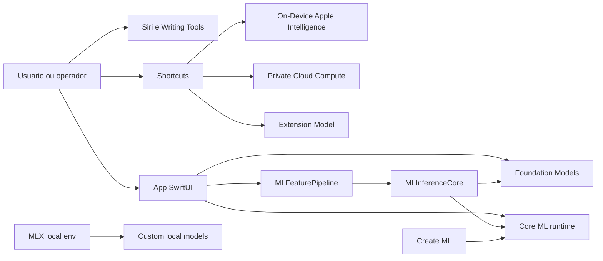
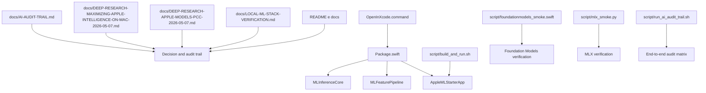
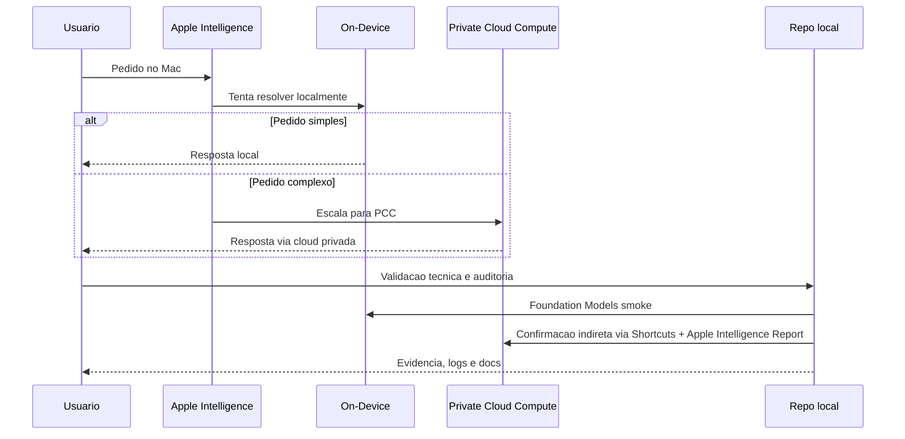

# Apple ML Starter

Starter Apple-first para ML e Apple Intelligence em MacBook com foco em trilha auditavel, execucao local e comparacao entre:

- `Foundation Models`
- `Shortcuts + Private Cloud Compute`
- `Core ML + Create ML`
- `MLX`

## Estado atual

- `Xcode 26.4.1`
- `Swift 6.3.1`
- `macOS 26.3.1` na maquina validada
- `Create ML 6.2` confirmado em `/Applications/Xcode.app/Contents/Applications/Create ML.app`
- `Foundation Models` validado localmente com geracao real
- `MLX 0.31.2` e `mlx-metal 0.31.2` validados com GPU real
- repo publicado em `origin/main`

## Mapa do sistema



## Arquitetura do repo



## Fluxo Apple Intelligence maximo no Mac



## O que existe no repo

- `Package.swift`
  Entrypoint do projeto Swift Package para abrir no Xcode.
- `OpenInXcode.command`
  Launcher explicito via `xed`.
- `Sources/AppleMLStarterApp`
  App macOS SwiftUI para exercitar inferencia local.
- `Sources/MLFeaturePipeline`
  Preprocessamento e feature extraction.
- `Sources/MLInferenceCore`
  Contrato de inferencia, versao do modelo, telemetria e fallback.
- `script/build_and_run.sh`
  Build + app bundle + launch local.
- `script/foundationmodels_smoke.swift`
  Smoke test real de `Foundation Models`.
- `script/mlx_smoke.py`
  Smoke test real de `MLX`.
- `script/run_ai_audit_trail.sh`
  Runner de trilha auditavel.
- `docs/`
  Verificacao, deep research e trilha operacional.

## Como abrir

1. Abra [Package.swift](/Users/healthOS/ML/Package.swift:1) no Xcode.
2. Ou execute [OpenInXcode.command](/Users/healthOS/ML/OpenInXcode.command:1).
3. Rode o target `AppleMLStarterApp`.

## Como executar

### Setup local completo

```bash
./script/setup_local_ml_stack.sh
./script/check_local_ml_stack.sh
```

### Build local

```bash
swift build
./script/build_and_run.sh
```

### Foundation Models

```bash
env HOME=/Users/healthOS/ML CLANG_MODULE_CACHE_PATH=/Users/healthOS/ML/.build/ModuleCache \
xcrun swiftc -parse-as-library script/foundationmodels_smoke.swift -o .build/foundationmodels_smoke && \
./.build/foundationmodels_smoke
```

### MLX

```bash
.venv-mlx/bin/python script/mlx_smoke.py
.venv-mlx/bin/python script/mlx_lm_generate.py --prompt "Explique MLX-LM em portugues."
```

### Ollama local

```bash
./script/ollama_smoke.sh
OLLAMA_MODEL=gemma4 ./script/ollama_smoke.sh "Resuma Apple Intelligence em uma frase."
OLLAMA_PULL_IF_MISSING=1 OLLAMA_MODEL=qwen2.5:0.5b ./script/ollama_smoke.sh
```

### llama.cpp

```bash
llama-cli --version
```

### Trilha auditavel completa

```bash
./script/run_ai_audit_trail.sh
```

## Trilha auditavel

Objetivo: deixar uma cadeia verificavel de "o que usar", "como provar" e "onde registrar".

| Trilha | Superficie | Execucao | Evidencia |
|---|---|---|---|
| `Foundation Models` | App / Swift | `script/foundationmodels_smoke.swift` | saida do smoke test |
| `MLX` | Python local Apple Silicon | `script/mlx_smoke.py` | device GPU e tensor result |
| `MLX-LM` | LLM open source local | `script/mlx_lm_generate.py` | geracao por modelo Hugging Face/MLX |
| `Ollama` | Servidor local de modelos | `script/ollama_smoke.sh` | modelo local e resposta via runtime Ollama |
| `llama.cpp` | Runtime GGUF local | `llama-cli --version` e modelos `.gguf` | binario Metal-ready |
| `Core ML / Create ML` | Xcode / model export | integrar `.mlmodel` no bundle | modelo presente e inferencia no app |
| `Apple Intelligence + PCC` | Shortcuts / sistema | criar atalho com `Use Model -> Private Cloud Compute` | `Apple_Intelligence_Report.json` |

Detalhes operacionais em [AI-AUDIT-TRAIL.md](/Users/healthOS/ML/docs/AI-AUDIT-TRAIL.md:1).

## Leituras principais

- [LOCAL-ML-STACK-VERIFICATION.md](/Users/healthOS/ML/docs/LOCAL-ML-STACK-VERIFICATION.md:1)
- [DEEP-RESEARCH-APPLE-MODELS-PCC-2026-05-07.md](/Users/healthOS/ML/docs/DEEP-RESEARCH-APPLE-MODELS-PCC-2026-05-07.md:1)
- [DEEP-RESEARCH-MAXIMIZING-APPLE-INTELLIGENCE-ON-MAC-2026-05-07.md](/Users/healthOS/ML/docs/DEEP-RESEARCH-MAXIMIZING-APPLE-INTELLIGENCE-ON-MAC-2026-05-07.md:1)
- [AI-AUDIT-TRAIL.md](/Users/healthOS/ML/docs/AI-AUDIT-TRAIL.md:1)

## Proximos passos recomendados

1. Criar atalho real no Mac com `Use Model -> Private Cloud Compute`.
2. Exportar `Apple_Intelligence_Report.json` para provar roteamento via PCC.
3. Integrar um `.mlmodel` real do Create ML no app.
4. Adicionar uma trilha `Foundation Models` dentro do app, nao apenas no smoke test.
5. Se quiser pesquisa mais livre, expandir a trilha `MLX` com modelo e prompt reais.
