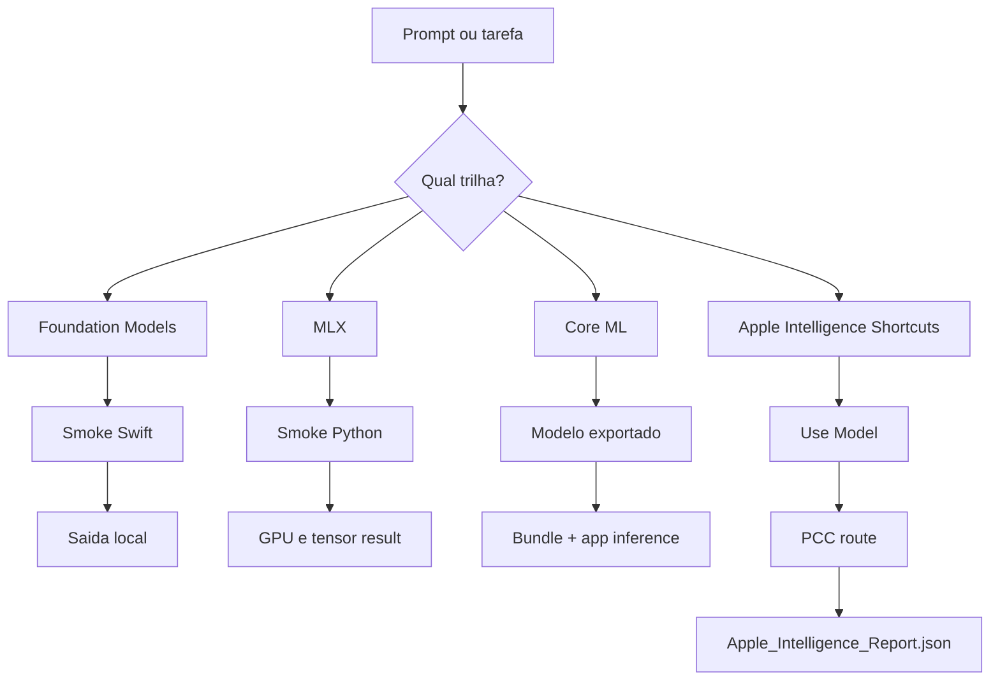

# AI Audit Trail

Data base: `2026-05-07`

## Objetivo

Documentar uma trilha auditavel e executavel para todas as rotas de IA relevantes neste repo.

## Superficies auditadas

### 1. Foundation Models

Objetivo:

- provar que a maquina roda `Foundation Models` de forma real

Artefatos:

- `script/foundationmodels_smoke.swift`
- `docs/LOCAL-ML-STACK-VERIFICATION.md`

Execucao:

```bash
env HOME=/Users/healthOS/ML CLANG_MODULE_CACHE_PATH=/Users/healthOS/ML/.build/ModuleCache \
swiftc -parse-as-library script/foundationmodels_smoke.swift -o .build/foundationmodels_smoke && \
./.build/foundationmodels_smoke
```

Evidencia esperada:

- `availability=available`
- `supports_en_US=true`
- `supports_pt_BR=true`
- resposta real gerada

### 2. MLX

Objetivo:

- provar stack local moderna e funcional em Apple Silicon

Artefatos:

- `.venv-mlx`
- `script/mlx_smoke.py`

Execucao:

```bash
.venv-mlx/bin/python script/mlx_smoke.py
```

Evidencia esperada:

- `mlx_version=0.31.2`
- `default_device=Device(gpu, 0)`
- `metal_available=True`
- `result=[2.0, 4.0, 6.0]`

### 3. Core ML / Create ML

Objetivo:

- registrar a trilha nativa de treino e deploy Apple

Artefatos:

- `Sources/MLInferenceCore/Resources/Models/`
- `Create ML.app`

Execucao alvo:

1. criar `.mlproj` no Create ML
2. exportar `.mlmodel`
3. copiar para `Sources/MLInferenceCore/Resources/Models/`
4. trocar fallback por adapter tipado
5. rodar o app

Evidencia esperada:

- asset de modelo presente
- app detecta modelo no bundle
- inferencia deixa de usar fallback

### 4. Apple Intelligence + Private Cloud Compute

Objetivo:

- usar o maximo de Apple Intelligence no MacBook
- confirmar quando PCC foi usado

Superficie principal:

- `Shortcuts`

Fluxo recomendado:

1. abrir `Shortcuts`
2. criar atalho com `Use Model`
3. rodar o mesmo prompt em:
   - `On-Device`
   - `Private Cloud Compute`
   - `Extension Model` se quiser comparativo
4. abrir `System Settings -> Privacy & Security -> Apple Intelligence Report`
5. exportar `Apple_Intelligence_Report.json`

Evidencia esperada:

- diferenca observavel entre rotas
- relatorio JSON com requests enviados a PCC

## Matriz de prova



## Ordem recomendada de uso

1. `Apple Intelligence + Shortcuts` quando a meta for usar o maximo possivel da inteligencia da Apple no Mac.
2. `Foundation Models` quando a meta for logica nativa dentro do app.
3. `Core ML / Create ML` quando a meta for modelo custom local e deterministico.
4. `MLX` quando a meta for pesquisa e liberdade de experimentacao.
